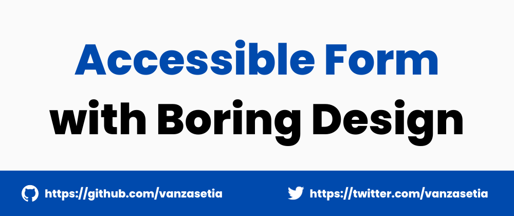
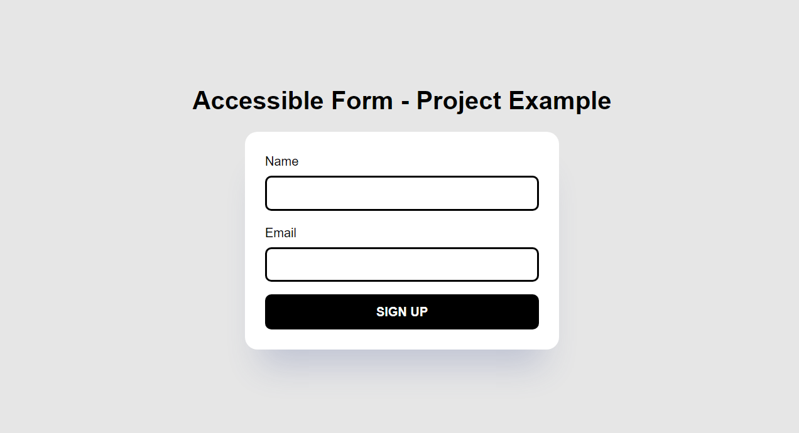

# Accessible Form (Finished Project)

## Table of contents
- [Overview](#overview)
  - [Introduction](#introduction)
  - [Links](#links)
  - [Screenshots](#screenshots)
  - [Built with](#built-with)
- [Author](#author)
- [License](#license)

## Overview
[(Back to top)](#table-of-contents)

### Introduction

### Links
- [Live Review](https://a11yform.netlify.app/)
- [Code Newbie Article]()

### Screenshots

### Built With
[(Back to top)](#table-of-contents)

- HTML Semantic Tags
- [BEM (Block, Element, Modifier)](https://sparkbox.com/foundry/bem_by_example)
- JavaScript
- CSS Grid
- CSS `clamp()`

## Author
[(Back to top)](#table-of-contents)

- Frontend Mentor - [@vanzasetia](https://frontendmentor.io/profile/vanzasetia)
- Twitter - [@vanzasetia](https://twitter.com/vanzasetia)
- Code Newbie - [@vanzasetia](https://community.codenewbie.org/vanzasetia)
- Want to see me on other platforms? [Check my linktree!](https://linktr.ee/vanzasetia)

## License
[(Back to top)](#table-of-contents)

>You can check out [the full license](./LICENSE)
